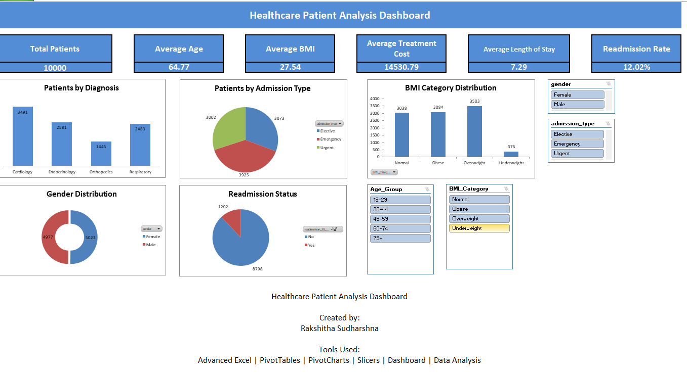

# 🏥 Healthcare Patient Analysis Dashboard

## 📌 Overview

An Excel-based healthcare analytics dashboard built using **10,000 patient records** to analyze patient demographics, admission patterns, treatment information, BMI categories, and 30-day readmissions.

The dashboard uses **PivotTables, PivotCharts, Slicers, and KPI summaries** to provide an interactive view of healthcare data and support quick analysis and reporting.

---

## 🎯 Project Objectives

- Analyze patient demographics
- Monitor key healthcare KPIs
- Understand admission patterns
- Analyze diagnosis distribution
- Examine BMI categories
- Track 30-day readmissions
- Analyze treatment costs and length of stay
- Provide interactive filtering for stakeholders
- Present healthcare insights through an Excel dashboard

---

## 📊 Dataset

The project contains **10,000 patient records** with **19 columns**.

### Raw Data Columns

| Column | Description |
|---|---|
| `patient_age` | Age of the patient |
| `gender` | Patient gender |
| `bmi` | Body Mass Index |
| `systolic_bp` | Systolic blood pressure |
| `diastolic_bp` | Diastolic blood pressure |
| `cholesterol_mg_dl` | Cholesterol level |
| `fasting_blood_sugar` | Fasting blood sugar level |
| `heart_rate_bpm` | Heart rate |
| `previous_admissions` | Number of previous admissions |
| `admission_type` | Elective, Emergency, or Urgent |
| `primary_diagnosis` | Primary diagnosis category |
| `medication_adherence` | Medication adherence level |
| `length_of_stay_days` | Length of hospital stay |
| `treatment_cost_usd` | Treatment cost in USD |
| `readmission_30_days` | Whether the patient was readmitted within 30 days |
| `Age_Group` | Derived age category |
| `BMI_Category` | Derived BMI category |
| `Blood Pressure Status` | Derived blood pressure category |
| `Cost Category` | Derived treatment cost category |

---

## 📑 Workbook Structure

The Excel workbook contains 8 sheets:

| Sheet | Description |
|---|---|
| `Dashboard` | Main interactive dashboard with KPI cards and charts |
| `KPI` | Summary healthcare KPI values |
| `healthcare_patients` | Raw patient dataset containing 10,000 records |
| `Patients by Diagnosis` | PivotTable showing patients by diagnosis |
| `Patients by Admission Type` | PivotTable showing patients by admission type |
| `Gender Distribution` | PivotTable showing patient gender distribution |
| `Readmission` | PivotTable showing 30-day readmission counts |
| `BMI Category` | PivotTable showing patients by BMI category |

---

## 📈 Key Performance Indicators

| KPI | Value |
|---|---:|
| Total Patients | 10,000 |
| Average Age | 64.77 years |
| Average BMI | 27.54 |
| Average Treatment Cost | $14,530.79 |
| Average Length of Stay | 7.29 days |
| Readmission Count | 1,202 |
| Readmission Rate | 12.02% |

---

## 📊 Dashboard Features

### Patient Overview

- Total patient count
- Average patient age
- Average BMI
- Average treatment cost
- Average length of stay
- 30-day readmission rate

### Diagnosis Analysis

The dashboard analyzes patients across:

- Cardiology
- Endocrinology
- Orthopedics
- Respiratory

### Admission Analysis

Patient admissions are categorized as:

- Elective
- Emergency
- Urgent

### Demographic Analysis

- Gender distribution
- Age analysis
- BMI category analysis

### Readmission Analysis

Tracks whether patients were readmitted within 30 days.

### Interactive Filtering

The Excel dashboard uses interactive filtering to allow stakeholders to quickly explore the patient data.

---

## 💡 Key Business Insights

- **Cardiology** is the largest diagnosis category with **3,491 patients**.
- **Emergency admissions** are the most common admission type with **3,925 patients**.
- The gender distribution is nearly balanced, with **5,023 female** and **4,977 male** patients.
- **1,202 patients** were readmitted within 30 days, resulting in a **12.02% readmission rate**.
- **Overweight** is the largest BMI category with **3,503 patients**.
- **Obese** patients account for **3,084 patients**.
- Normal BMI accounts for **3,038 patients**, while **375 patients** are classified as underweight.
- The dashboard provides a consolidated view of patient demographics, admissions, diagnoses, treatment costs, and readmissions.

---

## 🛠️ Tools & Technologies

- Microsoft Excel
- PivotTables
- PivotCharts
- Excel formulas
- Slicers
- KPI reporting
- Data cleaning
- Data categorization

---

## 🧠 Skills Demonstrated

- Excel Dashboard Development
- Data Analysis
- Data Cleaning
- PivotTable Analysis
- PivotChart Development
- KPI Reporting
- Data Categorization
- Healthcare Analytics
- Interactive Dashboard Design
- Business Intelligence
- Data Visualization
- Analytical Problem Solving

---

## 📸 Project Preview



---

## 📁 Project Structure

```text
healthcare-patient-analysis-dashboard/
│
├── README.md
├── Healthcare_Patient_Analysis_Dashboard.xlsx
│
└── images/
    └── healthcare-dashboard.png
